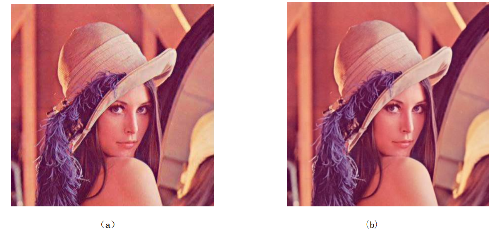

# JPEG_python
A simple implementation for JPEG algorithm used python3

#### Components of code

* main.py : `main function, control the general process of compression and decompression`
* tools/Color_Change.py: `Color space change, RGB->YUV, YUV->RGB`
* tools/Fill.py: `Fill length and width of the image to multiple of 16 with zero`
* tools/Sample.py: `The operator of Sampling and unsampling`
* tools/Block.py: `The operator of partition and merge `
* tools/DCT.py: `DCT and IDCT`
* tools/Quantization.py:`quantization and inverse quantization`
* tools/Zigzag.py: `Zigzag sort`
* tools/Encode.py: `DC and AC encode and decode, entropy encode and decode`
* tools/Table.py: `some tables used for quantization and entropy encode`

#### RUN

`python main.py`

#### Result

​&ensp;&ensp;&ensp;&ensp;&ensp;&ensp;&ensp;&ensp;&ensp;&ensp;&ensp;&ensp;&ensp;&ensp;(a)   after JPEG decode&ensp;&ensp;&ensp;&ensp;&ensp;&ensp;&ensp;&ensp;&ensp;&ensp;&ensp;&ensp;&ensp;&ensp;&ensp;&ensp;&ensp;&ensp;&ensp;&ensp;&ensp;&ensp;&ensp;&ensp;&ensp;&ensp;&ensp;&ensp;&ensp;&ensp;&ensp;&ensp;&ensp;&ensp;&ensp;&ensp;&ensp;&ensp;&ensp;&ensp;&ensp;&ensp;&ensp;&ensp;&ensp;&ensp;&ensp;&ensp;&ensp;(b) original image
